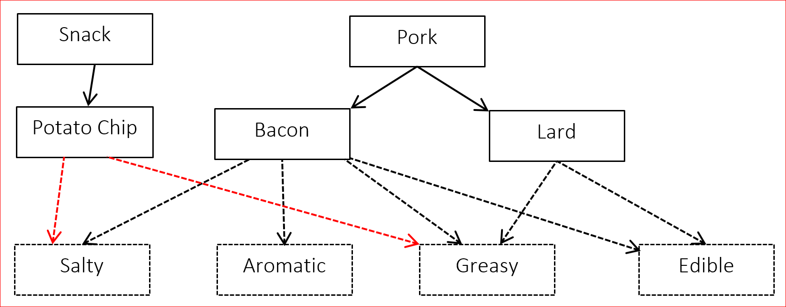

Lesson 6.06 — Interfaces
====================================================================================================

Overview
--------
### Objectives — _Students will be able to…_
- **Implement and use** interfaces.

### Assessments — _Students will…_
- **Complete** an in-class competition

### Homework — _Students will…_
- **Read** BJP 9.6
- **Summarize notes** in notebook for tomorrow’s notebook check
- **For extra credit:**
  - Generate your own class hierarchy that demonstrates the same concepts illustrated by the
    Financial Class Hierarchy outlined in the book. The extra-credit project is due \[one week from
    assignment\].


Materials & Prep
----------------
- **Projector and computer** (if you are able to/opt to use Eclipse with your students)
- **White paper** **and** **markers**
- **In Class** [Poster 6.6]
- **Small group assignments** (≈4 people per group)


Pacing Guide
------------
| Section                                          | Total Time |
|--------------------------------------------------|-----------:|
| Bell-work and attendance                         |       5min |
| Introduction                                     |      15min |
| Class competition (small groups)                 |      20min |
| Whole group review and competition judging/award |      15min |


Procedure
---------
Hook your class by announcing a class competition. Feature TEALS swag, extra credit points, free
homework passes, or raffle tickets as prizes. Break students into their small groups before
beginning your introduction.

### Bell-work and Attendance \[5 minutes\]

### Introduction \[10 minutes\]

1. Begin with a lecture/discussion about inheritance and interfaces.

2. We’ve seen that inheritance is a useful tool for programming. (Ask students why inheritance is
   useful: it enables polymorphism and code sharing.)

   But inheritance has limitations:

   - Ask students if we can inherit code from more than one superclass. (_No._)

   - If you want an is-a relationship or polymorphism, but you don’t want to give a subclass access
     to the code, inheritance won’t give you the encapsulation you need.

3. There’s a special tool we can use called an *interface* that allows you to represent a common
   *supertype* between classes without actually sharing code.

   - An **interface** consists of a set of method declarations without a method body.

   - Think of the interface as a *promise* of behavior; the method is declared, but not defined. The
     method *will be* (is promised to be) defined in the subclass method.

     If you don’t define the method in your subclass (if you don’t follow through on your promise),
     you’ll get an error.

4. Demonstrate what this looks like in practice. You can use the example given below, or ask the
   class to help you generate an example of their own choosing. Start with a sketch so students can
   visualize the relationships between interfaces and classes, and review inheritance vocabulary as
   you construct the diagram:

   

   Interfaces are represented by dotted boxes and arrows, class and class hierarchies are
   represented by solid lines and boxes.

   If you wish to show your students that interfaces can be shared by unrelated class hierarchies,
   you can add to the diagram above as shown below. The color of the interface arrows has been
   changed to red so it’s easier to see where to draw the lines.

   

   ``` Java
   public interface Salty {          // This is a promise to implement the sodiumContent
       double sodiumContent();       // in the class that implements the Salty interface.
   }

   public interface Aromatic {
       String describeAroma();       // Notice the lack of "public"! Public is *assumed*.
   }

   public interface Greasy {         // Point out that interfaces look just like classes
       double amountOfGreaseInMg();  // but without fields or method bodies
   }

   public interface Edible {
       double calories();
   }
   ```

5. As you write the class header below, point out the keyword `implements` and match up the
   interfaces in the header with the interfaces in the diagram.

   ``` Java
   public class Bacon extends Pork implements Salty, Aromatic, Greasy, Edible {
       private double amountInKg;

       public Bacon(double amount) {
           amountInKg = amount;
       }

       public double calories() {
           return amountInKg * CALORIES_PER_KG_OF_BACON;
       }
   ```

   - Ask students to point out the header and the constructor. Ask them if they can guess why you
     included a *calories* method. If they don’t remember the answer from their reading assignment,
     point to the interfaces without any additional comment (you’re following through on your
     *promise* to implement the method).

   - Ask students if the *Bacon* class is complete. Have them help you fix it by adding the other
     methods you promised to implement in the *Aromatic*, *Greasy*, and *Salty* interfaces. Point
     out Poster 6.6 as an aid to help students write interfaces correctly.

### Class Competition (Small Groups) \[20 minutes\]

1. On the board or overhead, project a series of five interfaces on a theme that you feel will
   creatively engage your class (you should blank out the parts that you feel will make the example
   most engaging). Some sample classes and interfaces with suggested methods:

   1. Subclasses: `Red`, `Orange`, `Yellow`, `Green`, `Blue`
      - Interface: `color`
      - Sample Methods: `double wavelengthInNm`, `Boolean isPrimaryColor`

   2. Subclasses: `Wood`, `Brick`, `Adobe`, `Stone`, `Canvas`
      - Interface: `buildingMaterial`
      - Sample Methods: `String movableHousing`, `double costPerLb`

   3. Subclasses: `Boeing 747`, `Pheasant`, `PaperAirplane`, `Cannonball`
      - Interface: `flies`
      - Sample Methods: `getMaximumAltitude`, `getRange`, `getSpeed`

2. Invite each team to provide a team name, and explain the challenge:

   1. Students should define classes to implement as many combinations of interfaces as possible.

   2. Students must include at least 1 method for each interface.

   3. Each class has to implement the interface methods and include a constructor.

3. The team with the most combinations of interfaces at the end of the time limit (≈20 minutes) win
   the competition.

### Whole Group Review & Competition Judging/Award \[15 minutes\]
Leave time to have groups share their interfaces with the rest of the class during whole group
discussion. Pay attention to any particularly creative or wacky examples that students come up with.


Accommodation and Differentiation
---------------------------------
If your students require additional practice with interfaces before beginning the class competition,
work through building a class *Lard* that implements the interfaces *Greasy* and *FoodItem*.

### During the Activity

If your students require extra scaffolding, generate 1 method for each interface as a whole group
before the competition begins. Write these methods on the board with the interfaces for easy
reference.

If your students require an extra challenge, change rule *c* (in step 2 of *Activity*) to include
additional methods and/or fields.


Teacher Prior CS Knowledge
---------------------------
A student may ask about the _Is-A_ and _Has-A_ relationships introduced in the previous lesson,
which are great for describing inheritance vs composition. But what about interfaces? The
relationship that can be used is _Can-Do_. A class that implements an interface can do the behaviors
specified in the class it implements.


Misconceptions
--------------
Students often have confusion on the difference between extends vs implements. Syntactically is
fairly straightforward to extend from a super class and implement from an interface. Conceptually,
inheritance (extends) is used to define a class hierarchy where common functionally is factored out
into the superclass. In contract, interfaces (implements) is used to separate out the methods
definition from the method implementation. No class hierarchy is implied when implementing an
interface.


Video
-----
- BJP 9-3, _Implement Comparable Interface_<br>
  <http://media.pearsoncmg.com/aw/aw_reges_bjp_2/videoPlayer.php?id=c10-3>

- CS Homework Bytes, _Interface and Abstract Classes, with Elizabeth_<br>
  <https://www.youtube.com/watch?v=iiZ_TIZsE6Q>

- CSE 143, _Interfaces_ (note: uses ArrayIntList written in class as an example) (1:23–26:35)<br>
  <https://www.youtube.com/watch?v=KLJEss4jKf8&start=80>


Forum discussion
----------------
[Lesson 6.06 Interfaces (TEALS Discourse account required)](http://forums.tealsk12.org/c/unit-6/6-06-interfaces)


[Poster 6.6]:    https://raw.githubusercontent.com/TEALSK12/apcsa-public/master/curriculum/Unit6/Poster%206.6.pptx
