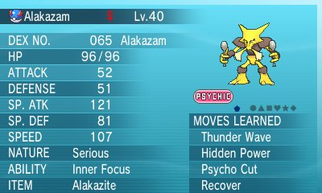

Lesson 3.07 — Pokémon Battle Programming Project
====================================================================================================

Overview
--------
### Objectives — _Students will be able to…_
- **Write** a program that requests user input and returns data.

### Assessments — _Students will…_
- **Write** a program that calculates damage done to Pokémon in a battle.

### Homework — _Students will…_
- **Summarize** their class notes since the last exam
  - If they are missing notes, get them from another student or supplement them from the textbook


Materials & Prep
----------------
- **Projector and computer** (if you are able to/opt to use Eclipse with your students)
- **Whiteboard and markers**
- **Classroom copies** of [WS 3.7] LP Battle
- **Video** of sample battle (<http://youtu.be/k7K5LEE9xxw?t=48s>)
- **Advanced damage calculator** (<https://pokemonshowdown.com/damagecalc/>)

The 8-minute video demonstrates a typical battle sequence from one of the more recent Pokémon
versions. If your class does not play the video game, you could show battle footage of the anime
series, the card game, or the coin game. As the instructor, you should familiarize yourself with the
sequence of a Pokémon battle, so you can help students with procedural decomposition and grade
different student solutions.


Pacing Guide
------------
| Section                                 | Total Time |
|-----------------------------------------|-----------:|
| Bell-work and attendance                |       5min |
| Introduction to lab & viewing of battle |      10min |
| Student programming practice            |      40min |


Procedure
---------
The programming project today has students programming a “starter” Pokémon battle sequence. This is
a somewhat open-ended assignment, since students can submit a basic program that runs 1 or 2
interactions, or a complete battle sequence, depending on their level of understanding.

Student programs for this assignment will be a lobotomized version of a Pokémon battle since
students have not yet learned conditional statements. This is a deliberate move: students can focus
on building segments of code that accept basic user input, use the math class to generate random
numbers to determine battle outcomes (or roll-of-the-dice or spin for the card-game and coin game
versions), and return game text. Capitalize on student frustration by (or motivate students with the
prospect of) hinting at a more interactive program after the next few lessons on Ch. 4 and Ch. 5.

### Bell-work and Attendance \[5 minutes\]

### Introduction to Lab and Viewing of Battle \[10 minutes\]
At the beginning of class, introduce the lab and watch the sample battle video.

### Student Programming Practice \[40 minutes\]

1. Have students complete this programming project individually. Before you break out the class for
   lab time, read the question out loud to the class, taking time to pause between each of the
   requirements outlined in the lab assignment.

2. Ask students what their very first steps should be.

   - They should outline their approach in pseudocode or with a structure diagram. Remind them that
     this documentation should be submitted in order to get full credit for their lab, and refer
     them to the Algorithm for Solving Problems sheet.

   - Remind students to tackle one part of the problem at a time. Remind students that it is OK if
     they leave pseudocode in while they solve a different part of the problem, and partial credit
     should be given to correct pseudocode.

3. To encourage grit, have students review the steps they should take before raising their hand for
   a question:
   - Refer to notes, textbooks, and posters/displayed work around the room.
   - Work on a different part of the problem if they get stuck, then return to it later.
   - Ask another student for a hint, tip, or for error-spotting.

4. In an email, on the projector, or as a handout WS 3.7, give student the following questions to
   work on individually (or, if scaffolding requires it, in pairs).

----------------------------------------------------------------------------------------------------

#### PROGRAMMING PROJECT

Complete this programming project using your notes, the text book, and any online or in-class sources you like.  Your work must be your own; you may ask a friend to look over your work, or discuss procedural decomposition with you, but you must write all code on your own.  To receive full credit on this lab, you must submit a structure diagram or pseudocode-plan for each question.

Recall how to use Scanner to get user input:

``` Java
Scanner console = new Scanner(System.in);
System.out.print("Hello, what is your name? ");
String name = console.nextLine();

System.out.print("What is your age? ");
int age = console.nextInt();
```
     
##### Exercise 1
Write a method called battleStart() that introduces the battle, prompts the user to choose their first
Pokémon to battle, and outputs the pairing. battleStart() should also return the name of the Pokemon chosen. Your output should look something like this:

    Another trainer is issuing a challenge!

    Zebstrika appeared.

    Which Pokémon do you choose? Arcanine
    
    You chose Arcanine!

    It’s a Pokémon battle between Arcanine and Zebstrika! Go!

Call battleStart() from your main() method and store the name of the Pokemon in a variable.

##### Exercise 2
Write a method called damage() that takes a Pokemon’s name as a parameter and returns the about of HP after damage has been done. damage() should prompt the user for their base stats in order to calculate damage.  Use the following equations for calculating damage:

    Modifier = Same Type Attack Bonus (STAB) \* Random
    Damage = Modifier * ((2*Level+10)/250 + (Attack/Defense)*Base + 2)

_Hint: The Pokémon game always selects a random number between 0.85 and 1.0._

Your output should look like this:

    Zebstrika used Thunderbolt!

    Trainer, what are your Arcanine’s stats?
    Level:
    Attack:
    Defense:
    Base:
    STAB:
    HP:

    Arcanine sustained 10 points damage. 
    HP, after damage, are now 70.

Call damage() from your main() method with the Pokemon’s name from Exercise 1 and store the return value (HP) in a variable.

##### Exercise 3
Write a method called statsTable() that accepts the user’s Pokemon name, stats and learned moves as parameters, and outputs something similar to this image:



You are not required to align the columns of the tables in any fancy way, but if you do, use escape
sequences to align data. For your drawing, you may use code you’ve grabbed from the internet, or
recycle an image you created earlier in the year.

Sample output:

    Name      Alakazam
    Level     40
    ------------------------------
    HP        96
    ATTACK    52
    DEFENSE   51
    SP. ATK   121
    SP. DEF   81
    SPEED     107
    -------------------------------
    Moves Learned: Thunder Wave, Hidden Power, Psycho Cut, Recover
    
Call statsTable() from your main() method with the Pokemon’s name from Exercise 1 and the HP from Exercise 2 and any other values you’d like for the other parameters.

##### Conclusion
In your completed project should include the following methods:
  -	battleStart()
  -	damage()
  -	statsTable()

These methods should all be called in main() so that the player can experience the entire battle in one sitting.

Proper Java syntax and thorough comments are required.


----------------------------------------------------------------------------------------------------


Accommodation and Differentiation
---------------------------------
If you have students finish the lab quickly, invite them to check out the advanced damage calculator
online. They can add input fields to their own damage calculator, thus improving their Pokémon
simulation.

Alternatively, if students seem interested in increasing the interactivity of their battle sequence,
you can allow them to read ahead in the book. Students may read up on Bulbapedia (the wiki for
Pokémon) that Thunderbolt has a 10% chance of paralyzing its’ target. Invite students to think how
to add that factor into their battle simulation as they read through Ch. 4 and Ch. 5 materials.

If students are struggling with creating the graphic in Exercise 3, help students by writing helper
lines of code on the board, or creating a pseudocode outline as a whole group.


Forum discussion
----------------
[Lesson 3.07 Pokémon Battle Programming Project (TEALS Discourse account required)](http://forums.tealsk12.org/c/unit-3/3-07-pokemon-battle-programming-project)


[WS 3.7]:   https://raw.githubusercontent.com/TEALSK12/apcsa-public/master/curriculum/Unit3/WS%203.7.docx
