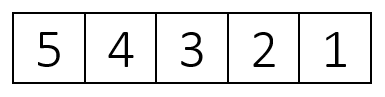

Lesson 4.05 — Shifting Values & Arrays of Objects
====================================================================================================

Overview
--------
### Objectives — _Students will be able to…_
- **Shift** elements within an array
- **Construct** arrays of objects

### Assessments — _Students will…_
- **Complete** Practice-It questions
- **Model** memory manipulation using array whiteboards

### Homework — _Students will…_
- **Read** BJP 7.4 “Nested Arrays” and BJP 7.5 “Rectangular Two-Dimensional Arrays”
- **Complete** self-check questions \#27-29 and exercise \#4


Materials & Prep
----------------
- **Projector and computer** with this page: <http://www.legendarypokemon.net/javacalc.html>
- **Classroom whiteboard & markers**
- **Array whiteboard & markers**
- **Small group assignments & seating arrangements** (if possible)

If your classroom structure allows it, arrange array whiteboards and markers at stations where
students can gather around them to model the concepts you teach during your intro. Ideally, students
will be standing huddled around the arrays, actively moving and rearranging items.

Pacing Guide
------------
| Section                              | Total Time |
|--------------------------------------|-----------:|
| Bell-work and attendance             |       5min |
| Introduction & small-group practice  |   20–25min |
| Practice-It Questions                |   25–30min |
| Error-checking algorithm (see below) |      10min |


Procedure
---------
Hook your class today by having them in small groups with the array whiteboards during your
Introduction. As you write out the code samples on the whiteboard, pause at different stages to
model what is happening to the elements stored in memory. As the introduction progresses, ask
students to model the changes for the whole class, with you and the other groups replicating their
manipulations. The key to this introduction is to have students working through the examples in
physical space, so make sure that all groups are working along with their array whiteboards.

### Bell-work and Attendance \[5 minutes\]

### Introduction & Small-Group Practice \[10 minutes\]

1. Introduce your example array called metroCardRides (or dailyDrive, milesWalked, whatever
   represents your students’ commute to school), and hold up an array of ints:

   

2. Briefly ask your students to direct you in constructing and initializing this array object, then
   ask students for some ideas as to how to move the 5 from the first element of the array to the
   last element, so that we end up with `[4][3][2][1][5]`.

   Give students a minute to try moving numbers around their whiteboards. Most numbers can be moved
   by shifting down the line with a for loop, but the first element will need to be removed to allow
   “space” for the shift.

3. Ask students how to store that first element (value 5) into a local variable, then write that
   code on your main whiteboard.
   ```
   int first = metroCardRides[0];
   ```
   Redirect students to the task of shifting the rest of your values on your array. As a class,
   discuss what you need the code to do, then ask the groups to draft some code and test that code
   on their array by tracing the code and checking for errors.

4. The correct loop for this loop looks like this:

   ``` Java
   for (int j = 0; j < metroCardRides.length – 1; j++) {
       metroCardRides[j] = metroCardRides[j + 1];
   }
   ```

   If students use metroCardRides.length instead of metroCardRides.length – 1, walk through the loop
   on your array whiteboard, demonstrating that metroCardRides.length causes Java to run off the end
   of the loop since there is no element at index 5. Alternatively, remind students about zero
   indexing, and see if they catch their own mistake.

5. Ask students to remind you (in pseudocode) what all the steps are that are needed to successfully
   shift the numbers in the array.

   - Model on your array whiteboard what steps have already been successfully written, and ask
     students what is left to do now that your array looks like this:

     

   - Select a group to give you the last step that re-inserts the first element at index 4, and ask
     the class to finish up the complete method, so your final method looks like this:

     ``` Java
     public static void firstToLast (int[] metroCardRides) {
         int first = metroCardRides[0];
         for (int j = 0; j < metroCardRides.length – 1; j++) {
             metroCardRides[j] = metroCardRides[j + 1];
         }
         metroCardRides[metroCardRides.length – 1] = first;
     }
     ```

6. If all students understand this method, move the last element to the first position, shifting the
   other elements one position to the right.

   - Direct students to start working on this challenge by re-setting their whiteboards and modeling
     the different steps that need to occur.

   - Walk around the room, checking that students are on the right path. Students should recognize
     that they need to temporarily store the last element as a variable now that they’re shifting
     array elements in the other direction.

7. Once students have written the code they think is correct, have them trace their own code and
   manipulate the arrays in their whiteboard.

   Encourage students to divide up this task so one student reads the code and another student moves
   the elements on the whiteboard. All members should be engaged in error checking.

8. The correct final code looks like this:

   ``` Java
   public static void firstToLastRight (int[] metroCardRides) {
       int last = metroCardRides[metroCardRides.length – 1];
       for (int j = metroCardRides.length – 1; j >= 1; j--) {
           metroCardRides[j] = metroCardRides[j – 1];
       }
       metroCardRides[0] = last;
   }
   ```

9. Spot check student code for an off-by-one error; starting the loop at 0 asks Java to look for a
   value at index -1, which doesn’t exist. (If students are modeling their code execution with the
   array whiteboards, they should catch this.)

   - If students “correct” this error by starting the loop at 1, ask them to model the code
     execution with their array white boards for you. The loop overwrites the value at j – 1 with
     the value at j, so the array will start filling in with all 5s as the loop repeats itself:

     

   - The solution to this is tricky! It might be worth discussing/working as a class if groups are
     getting stuck on this. The loop needs to shift values right by starting at the left and running
     backwards. See if you can get students to brainstorm this solution by manipulating the values
     on their whiteboards first.

     <br>
     <br>
     <br>
     

   - Now add back in the temporarily-stored value 1 at index 0.

10. Collect the array whiteboards (or have students set them aside) and briefly introduce arrays of
   objects.

   - **This is an optional extension**. Since we haven’t studied objects yet, you might want to
     leave this out if it is too far beyond your students’ zone of proximate knowledge.

   - Arrays of objects store reference to objects instead of a primitive type value. Drawing
     something like this might help student comprehension:

     

   - Ask students leading questions, getting them to tell you that because the array and the array
     contents are both objects, both need to be constructed.

   - Work through an example together as a class; ask students to help you construct an array of
     points. Your code should look something like this:
     ```
     Point[] points = {
         new Point(3, 7),
         new Point(4, 5),
         new Point(8, 2),
         new Point(7, 5),
         new Point(2, 8)
     };
     ```

### Practice-It Questions \[25-30 minutes\]
1. Depending on the mood and frustration levels in the class, you may choose to have students work
   in pairs.

   a. If students are really having a rough time, work through the first Practice-It question
      together as a whole group.

   b. Put soft, soothing (but upbeat) music on in the background to encourage work

2. Have students log in to Practice-It to complete the following Practice-It self-check questions:

   a. arrayCodeTracing3<br>
   b. arrayCodeTracing4<br>
   c. arrayMystery2<br>
   d. arrayMystery3<br>
   e. isPalindrome

3. Have students complete Practice-It Exercise append.

4. If more 25% or more of the class is struggling, return to whole group with the stipulation that
   students who understand the task may continue working independently. Otherwise, encourage peer
   tutoring, or using the textbook or notebooks for help.

### Error-Checking Algorithm \[10 minutes\]
At the end of class, if time permits, have students draft an algorithm for error-checking (see below
for details).


Accommodation and Differentiation
---------------------------------
If your class needs additional challenges, make the arrays in your examples a bit more
sophisticated. Change the values or add “tricks” to the code, and include some mistakes in your
delivery (written or conceptual) to let the students “catch” you. If they don’t catch you (and
you’re a good actor), fumble your way into revealing the mistake in logic or code, and let them
catch you so you can model a positive attitude towards error checking.

If students finish this lesson early, have them **draft an algorithm or checklist** that will help
students check their loop code when shifting values in an array (what are common errors to look
for?).

If the checklist is thorough, brief, and complete, have students create a handout or poster that you
can hang up or share with the class.

To adjust for reading/comprehension challenges in the ELL classroom, consider having students work
in small groups with the array whiteboards instead of answering questions within Practice It. Give
each group/student a print out with the questions, and have them turn in the worksheets at the end
of class.


Video
-----
- BJP 7-3–1: _Array shifting algorithm_<br>
  <http://media.pearsoncmg.com/aw/aw_reges_bjp_2/videoPlayer.php?id=c7-3-1>

- CSE 142: _Mystery code walk through_ (9:06–21:18)<br>
  <https://www.youtube.com/watch?v=DieHL2VO83k&start=560>

- CSE 142: _Reversing an array_ (43:42–49:30)<br>
  <https://www.youtube.com/watch?v=DieHL2VO83k&start=2622>

- CSE 142: _Absolute values an array_ (1:42–5:11)<br>
  <https://www.youtube.com/watch?v=DieHL2VO83k&start=102>


Forum discussion
----------------
[Lesson 4.05 Shifting Values & Arrays of Objects (TEALS Discourse account required)](http://forums.tealsk12.org/c/unit-4/4-05-shifting-values-arrays-of-objects)
